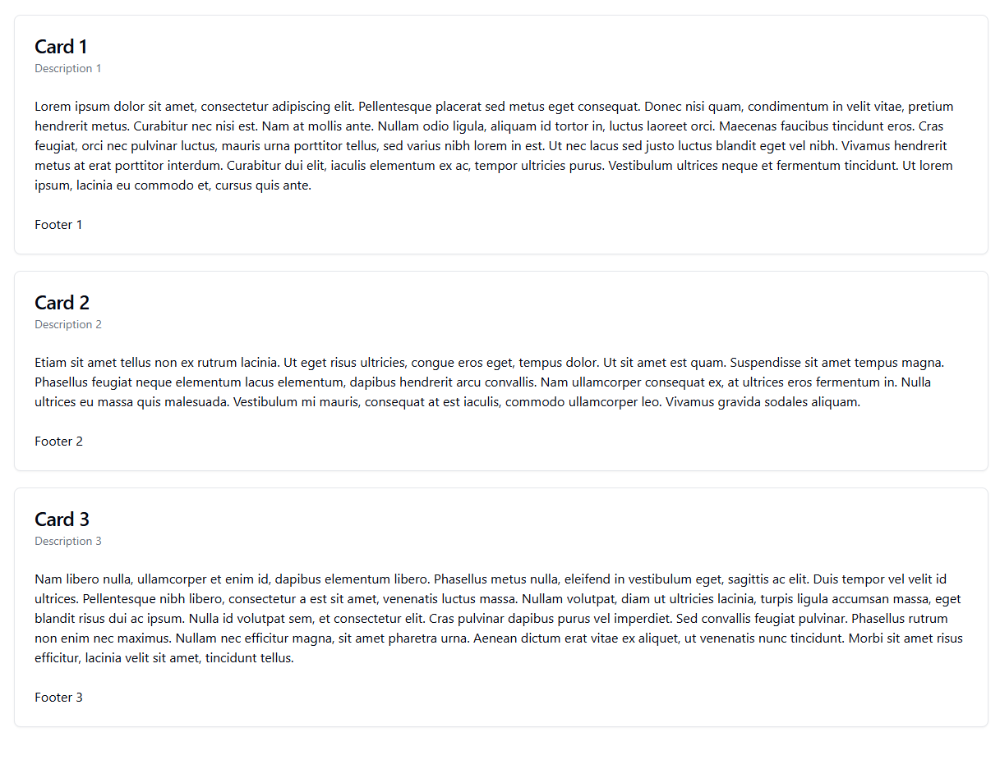

# pact-js-tutorial-consumer

This consumer was set up using Vue 3 in Vite. Please refer to [the tutorial docs](https://github.com/aureyia/pact-js-tutorial) for context.

## Description
The consumer expects a `/cards` endpoint to be available from [the provider](https://github.com/aureyia/pact-js-tutorial-provider). It uses this data to then display 3 sets of cards.



## Consumer Setup

```sh
npm install
```

### Run consumer in development mode

```sh
npm run dev
```

The page will be visible at: http://localhost:5173

_Note: For this page to load correct it will need the provider started as well._

### Run tests
```sh
npm run test
```
